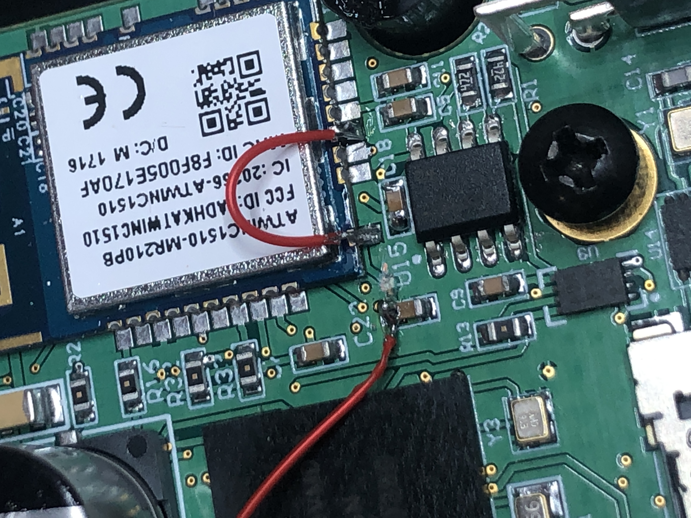
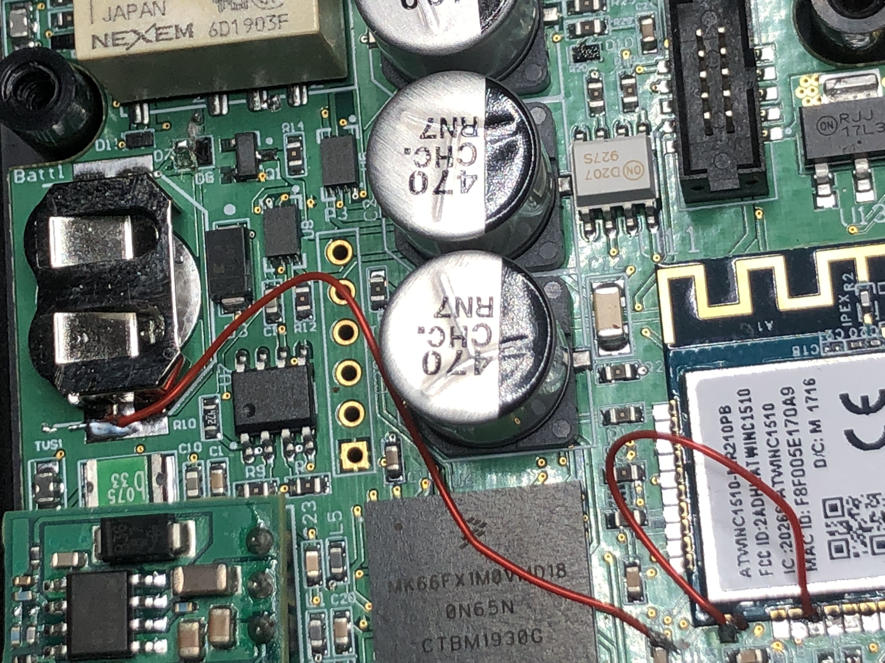

# CAN Logger 3 - Rev 3d Hardware
The revision 3d hardware had a circuit design flaw in the coin cell battery was connected to the Vbatt of the WiFi chip, thus quickly draining the coin cell battery. This made it so the CAN Logger did not accurately keep track of time. 

These boards were reworked to remove that circuit flaw and the result is the revision 3e boards.

Rev 3d CAN Logger numbers go from CSU01 to CSU19. 

## Hardware Rework

### Remove the ATWINC1510 from the Coin Cell Circuit
The VBat pin on the ATWINC1510 module is not supposed to be connected to the Real Time Clock (RTC) coin cell battery. Therefore, the trace to the ATWINC1510 needs to be cut. The trace is exposed above the label for U15, as shown in the photo. Cut this trace in a couple places with a razor knife and peel out a section so it does not make contact again. 
 

Once the Vbat pin for the ATWINC1510 is cut out of the circuit, it needs to be powered from 3.3 V rail. The photo shows a 30 gauge wire jumper from the 3.3V pin to the Vbat pin on the ATWINC1510.

### Reconnect the RTC
The top side of C22 is connected to the RTC battery pin on the processor. Connect this pad to one of the sides of the coin cell holder as shown in the photo.

 
Additionally, D7 needs to be removed. This keeps the coin cell battery isolated.  

Once these modifications are done, the resistance between the two sides of the coin cell battery holder will be on the order of 4 megaohms. Without the modification, the resistance is about 6.5 kiloohms, which drains the coincell battery faster than it should. 

Install a new battery. The voltage from the top of the coincell holder to ground, with a battery installed, should be above 2.7 V.